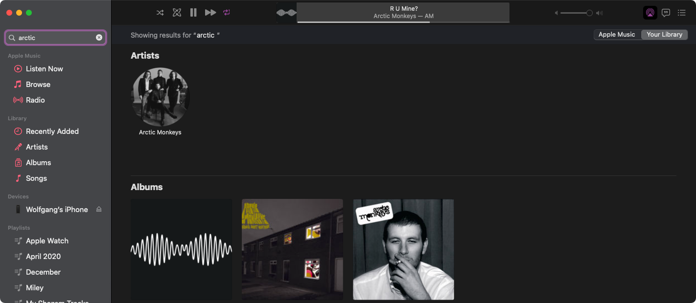
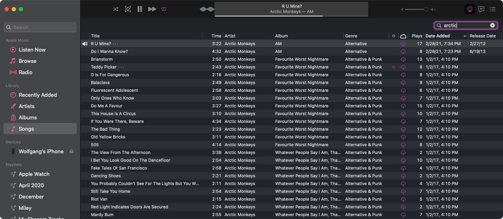
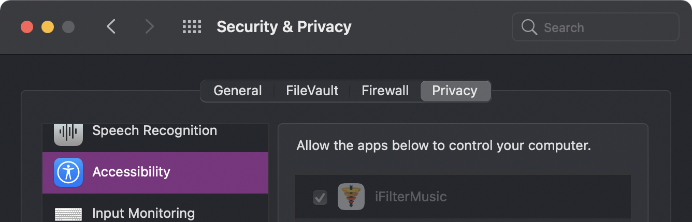

# iFilterMusic

 
 

# Information:

- Testetd on Music.app `1.1.3.3`  
- iFilterMusic is a very small app that makes it so the Filter field is always visible in the Music app for those old fogies (and people who love lists!) that are sitll holding on to their local libraries.

# Installation:

1. Download and unzip [iFilterMusic]()
2. Move it to your `/Applications` folder
3. Open `iFilterMusic` it should ask for accessability permissions
4. Allow `iFilterMusic` in `System Preferences > Secuirty & Privacy > Accessibility`

